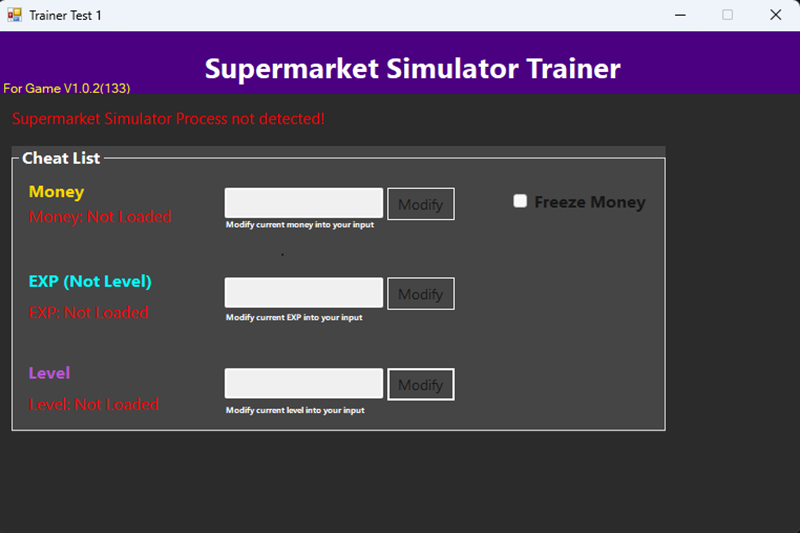
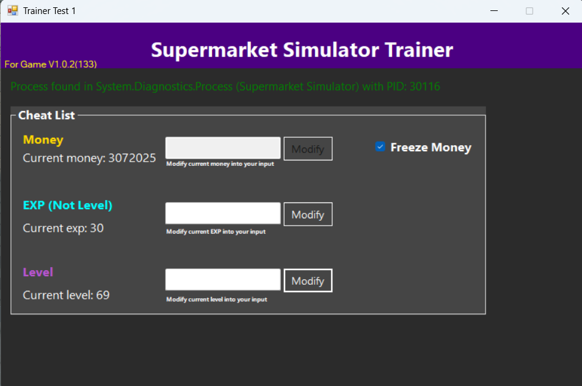
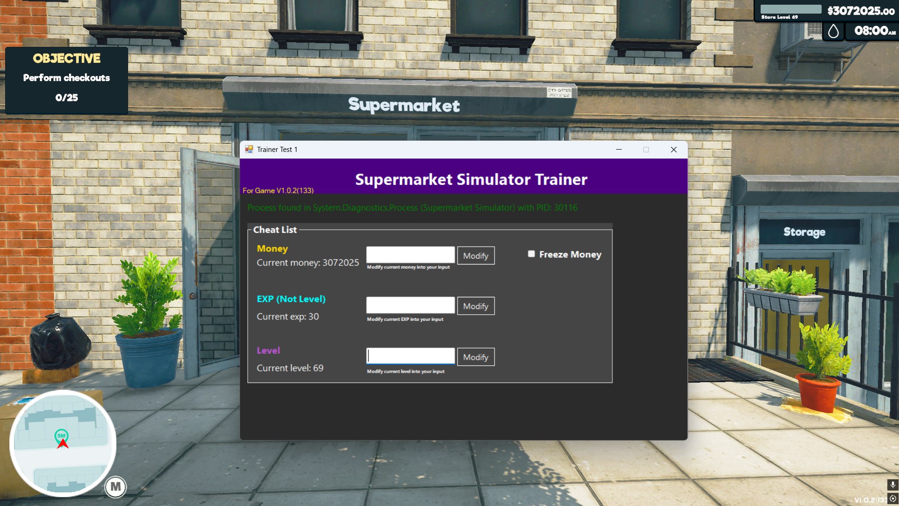
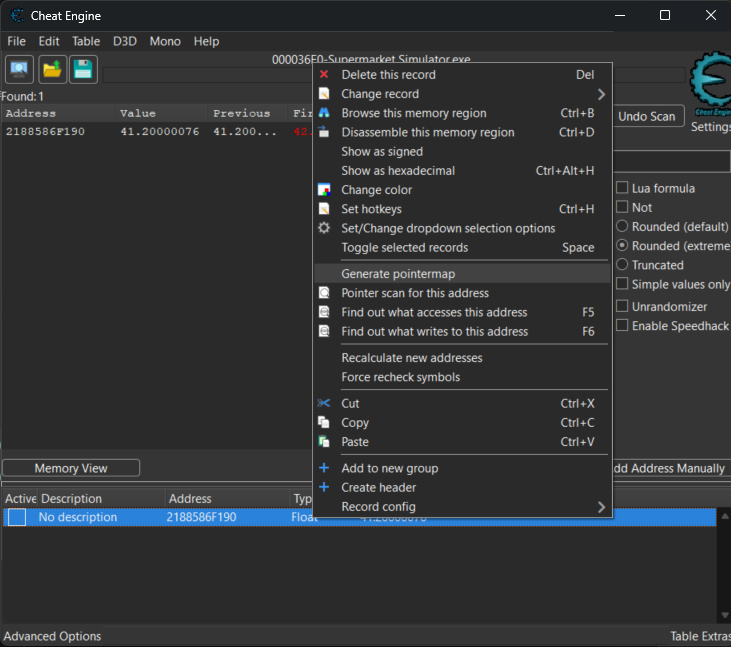
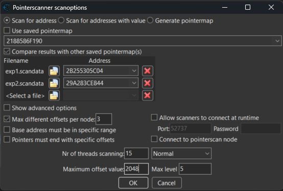
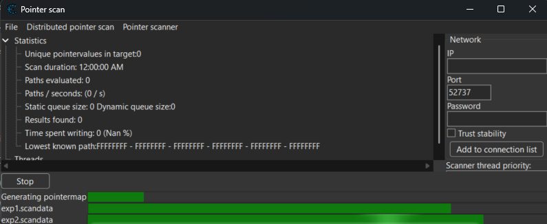
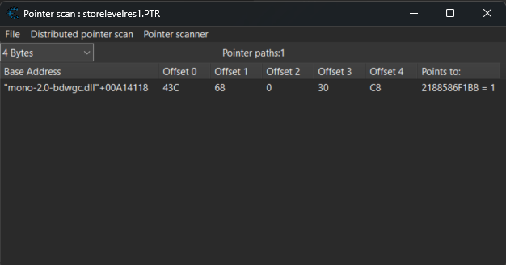

# Example Game Memory Trainer


## Read This

⚠️ **WARNING:**  
This project is intended for **educational and research purposes only**.  
Do **not** use it to cheat in online/multiplayer games or violate any game's ToS (Terms of Service).  
**Use responsibly and ethically!**

---

## Introduction

This repository demonstrates how to build a **game memory trainer** in C# (WinForms), focusing on real process memory editing in Windows.  
The example uses *Supermarket Simulator v1.0.2 (133)* as the demo target

---

## Features

- **Automatic game process detection**
- **Edit in-game Money, EXP, and Level** via a simple UI
- **Freeze Money:** lock the value so it never decreases
- Clean, readable, and well-commented code for easy learning
- Great starting point for anyone interested in game hacking, trainers, or the Windows API with C#

---

## Requirements

- **Windows OS:**  
  Project only works on Windows (tested on Windows 11)

- **.NET Framework 4.8:**  
  Make sure [.NET Framework 4.8](https://dotnet.microsoft.com/en-us/download/dotnet-framework/net48) is installed on your system

- **Visual Studio:**  
  Use [Visual Studio](https://visualstudio.microsoft.com/) (any recent version: Community, Professional, or Enterprise).  
  > *Note: Visual Studio Code is NOT supported.*

- **Cheat Engine:**  
  [Cheat Engine](https://cheatengine.org/) (any version should work, but the latest is recommended)

- **Supermarket Simulator v1.0.2 (133):**  
  The trainer is designed and tested for this specific game version

- **Administrator Privileges:**  
  (Optional)  
  If you experience issues or the trainer can't access the game memory, run both the game and the trainer as Administrator.

---

## How to Use

1. **Clone this repository to your computer:**
    ```bash
    git clone https://github.com/nartodono/Example-Game-Memory-Trainer.git
    ```

2. **Open the project folder:**  
   (By default, it will be named `Example-Game-Memory-Trainer`.)

3. **Open `Trainer.sln` using Visual Studio.**

4. **Build and run the project:**  
   - Click the **Start** button or press `F5` in Visual Studio.

5. **Start _Supermarket Simulator v1.0.2 (133)_** on your PC.

6. **Use the trainer app:**  
   The trainer will automatically detect the running game and let you edit Money, EXP, Level, or freeze the money value in real time.

---

> **Please Note:**  
> - This trainer is designed and tested for *Supermarket Simulator v1.0.2 (133)*.  
> - It may **not** work for other versions of the game since those versions have not been tested yet.

---

## Learning Section

You can see the main code logic here:  
[**Form1.cs**](Trainer/Form1.cs)  
You can ignore the other files—those are mostly auto-generated or boilerplate needed to make the program run in Visual Studio.

---

### How Does It Work?

This trainer works by accessing the memory of another application (the game), reading, and modifying its values.

1. **Process Detection:**  
   The program first searches for the *Supermarket Simulator* process. It continuously checks every second, so it always knows if the game is open or not.

2. **Pointer Chain Traversal:**  
   If the process is found, the trainer locates the memory addresses for **Money, EXP, and Level** by following a multi-level pointer chain.  
   These pointer chains were discovered using Cheat Engine.  
   *(See the section below: [How to Find the Pointer Chain](#how-to-find-the-pointer-chain))*

3. **Reading & Modifying Memory:**  
   Once the addresses are found, the trainer can read or write the values in real-time.

4. **Why Use a Pointer Chain?**  
   The pointer chain is needed because the actual memory addresses change every time the game starts (dynamic memory allocation). The chain lets us always find the right spot, no matter what address is used this session.

---

**Technical Note:**  
The entire memory manipulation in this project is based on **reverse engineering the game using Cheat Engine**.  
The relevant memory addresses (Money, EXP, Level) are dynamically found through **pointer chain analysis**.  
Pointer chains are located by first finding the value in Cheat Engine, then tracing back using the pointer scan feature, which is a standard reverse engineering approach for games with dynamic memory addresses.

---

### Screenshots

|  |  |
|:--:|:--:|
| *Inactive Trainer* | *Active Trainer* |



---

### How to Find the Pointer Chain

Assuming you have already found the value address using Cheat Engine (as shown below):

|  |
|:--:|
| _Find the correct value address using Cheat Engine (e.g., Money, EXP, Level)_ |

1. **Generate Pointermap:**  
   Right-click the found address and choose **"Generate pointermap"**.  
   Wait until the process finishes.

2. **Restart & Repeat:**  
   Close the game, open it again, and repeat step 1 to find the new address.  
   Generate a **second pointermap** file using the same process.

|  |
|:--:|
| _Right-click on the new address and generate another pointermap after restarting the game_ |

3. **Pointer Scan:**  
   With both pointermaps created, right-click the new found address and select **"Pointer scan for this address..."**.  
   A new Cheat Engine window will open.

4. **Compare with Saved Pointermaps:**  
   In the pointer scan window, check **"Compare results with other saved pointermap(s)"** and select the two pointermap files you just made.  
   (Optional) You can set the **Maximum Offset** to 2048 and the **Max Level** to 5 to narrow down the search depth.  
   Press **OK** to start the scan.

|  |
|:--:|
| _Configure the pointer scan settings: add both pointermaps, set offsets/levels, then start the scan_ |

5. **Wait for Scan to Complete:**  
   Cheat Engine will now scan and compare the pointermaps. Just wait until it’s finished.

|  |
|:--:|
| _Pointer scanner running: waiting for results_ |

6. **Analyze the Results:**  
   Once the scan is done, you will see results like below.  
   Here, you can see that the base address is `mono-2.0-bdwgc.dll + 00A14118` and the pointer chain (offsets) is:  
   `43C, 68, 0, 30, C8` (for the Level value; Money and EXP will have different last offsets).

|  |
|:--:|
| _Pointer scanner results: final pointer chain and offsets you can use in your trainer code_ |

> **Note:**  
> The screenshots above were not taken in a single continuous session.  
> They are a mix of different steps while searching for Money, EXP, and Level addresses, so you may notice that the addresses, pointermaps, and pointer scan results don't always match up perfectly from one image to the next.

**Tip:**  
This method ensures you get a reliable pointer chain that works even though the actual memory address changes every time the game is restarted (dynamic memory).  
The pointer chain you find here can then be used in your code to always locate the correct value in memory.

---

## License


This project is licensed under the [MIT License](LICENSE).

---

## FAQ

### Q: Is this project a cheating tool?

**A:**  
No, this project is intended **for educational and research purposes only**.  
It demonstrates the technical process of memory editing and reverse engineering using C#.  
Do **not** use it to cheat in online or multiplayer games, or violate any game's Terms of Service.

---

### Q: Does the trainer not work with version other than Supermarket Simulator V1.0.2(133)? 

**A:**  
This trainer is designed for **Supermarket Simulator v1.0.2 (133)**.  
If you use a different version, the memory layout and pointer chains may be different, so the trainer may not work as expected.  
If this happens, you will need to find and update the correct pointer chains for your game version.

> **Note:**  
> For this issue, a more robust technique is **signature scanning** (Array of Bytes / AoB scan),  
> which is more resistant to minor game updates because it searches for unique byte patterns instead of fixed memory addresses.

---

### Q: How do I update the pointer chain for a different version?

**A:**  
See the section [How to Find the Pointer Chain](#how-to-find-the-pointer-chain) in this README for step-by-step instructions using Cheat Engine.

---

### Q: Can I use this trainer with other games?

**A:**  
Technically, yes—**with significant modifications**.  
You will need to find the appropriate process, value addresses, and pointer chains for the other game using Cheat Engine or similar tools, and update the code accordingly.

---

### Q: Is it safe to use this project?

**A:**  
The code itself is safe and open source.  
However, modifying game memory can sometimes trigger anti-cheat protections in some games.  
**Always use this project for offline, single-player, and educational purposes only.**

---
