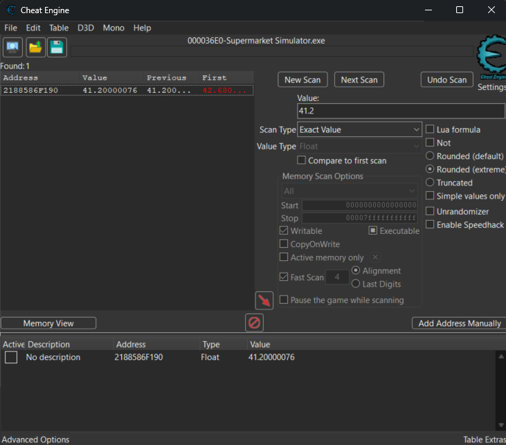

# Example Game Memory Trainer

## ⚠️ Read This

**WARNING:**  
This project is intended for **educational and research purposes only**.  
Do **not** use it to cheat in online/multiplayer games or violate any game's ToS (Terms of Service).  
**Use responsibly and ethically!**

---

## Introduction

This repository demonstrates how to build a **game memory trainer** in C# (WinForms), focusing on real process memory editing in Windows.  
The example uses *Supermarket Simulator v1.0.2 (133)* as the demo target

---

## Features

- **Automatic game process detection**
- **Edit in-game Money, EXP, and Level** via a simple UI
- **Freeze Money:** lock the value so it never decreases
- Clean, readable, and well-commented code for easy learning
- Great starting point for anyone interested in game hacking, trainers, or the Windows API with C#

---

## How to Use

1. **Clone this repository to your computer:**
    ```bash
    git clone https://github.com/nartodono/Example-Game-Memory-Trainer.git
    ```

2. **Open the project folder:**  
   (By default, it will be named `Example-Game-Memory-Trainer`.)

3. **Open `Trainer.sln` using Visual Studio.**

4. **Build and run the project:**  
   - Click the **Start** button or press `F5` in Visual Studio.

5. **Start _Supermarket Simulator v1.0.2 (133)_** on your PC.

6. **Use the trainer app:**  
   The trainer will automatically detect the running game and let you edit Money, EXP, Level, or freeze the money value in real time.

---

> **Please Note:**  
> - This trainer is designed and tested for *Supermarket Simulator v1.0.2 (133)*.  
> - It may **not** work for other versions of the game since those versions have not been tested yet.

---

## Learning Section

You can see the main code logic here:  
[**Form1.cs**](Trainer/Form1.cs)  
You can ignore the other files—those are mostly auto-generated or boilerplate needed to make the program run in Visual Studio.

---

### How Does It Work?

This trainer works by accessing the memory of another application (the game), reading, and modifying its values.

1. **Process Detection:**  
   The program first searches for the *Supermarket Simulator* process. It continuously checks every second, so it always knows if the game is open or not.

2. **Pointer Chain Traversal:**  
   If the process is found, the trainer locates the memory addresses for **Money, EXP, and Level** by following a multi-level pointer chain.  
   These pointer chains were discovered using Cheat Engine.  
   *(See the section below: [How to Find the Pointer Chain](#how-to-find-the-pointer-chain))*

3. **Reading & Modifying Memory:**  
   Once the addresses are found, the trainer can read or write the values in real-time.

4. **Why Use a Pointer Chain?**  
   The pointer chain is needed because the actual memory addresses change every time the game starts (dynamic memory allocation). The chain lets us always find the right spot, no matter what address is used this session.

---

### 🖼Screenshots

|  |  |
|:--:|:--:|
| *Inactive Trainer* | *Active Trainer* |


### How to Find the Pointer Chain

Assuming you have already found the value address using Cheat Engine (as shown below):



1. **Generate Pointermap:**  
   Right-click the found address and choose **"Generate pointermap"**.  
   Wait until the process finishes.

2. **Restart & Repeat:**  
   Close the game, open it again, and repeat step 1 to find the new address.  
   Generate a **second pointermap** file using the same process.


3. **Pointer Scan:**  
   With both pointermaps created, right-click the new found address and select **"Pointer scan for this address..."**.  
   A new Cheat Engine window will open.

4. **Compare with Saved Pointermaps:**  
   In the pointer scan window, check **"Compare results with other saved pointermap(s)"** and select the two pointermap files you just made.  
   (Optional) You can set the **Maximum Offset** to 2048 and the **Max Level** to 5 to narrow down the search depth.  
   Press **OK** to start the scan.


5. **Wait for Scan to Complete:**  
   Cheat Engine will now scan and compare the pointermaps. Just wait until it’s finished.


6. **Analyze the Results:**  
   Once the scan is done, you will see results like below.  
   Here, you can see that the base address is `mono-2.0-bdwgc.dll + 00A14118` and the pointer chain (offsets) is:  
   `43C, 68, 0, 30, C8` (for the Level value; Money/EXP will have different last offsets).


---

**Tip:**  
This method ensures you get a reliable pointer chain that works even though the actual memory address changes every time the game is restarted (dynamic memory).  
The pointer chain you find here can then be used in your code to always locate the correct value in memory.


